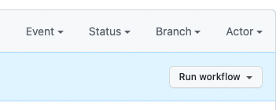
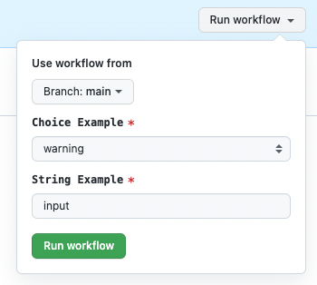

# Workflow-uri Manuale 

Workflow-urile pot fi declansate prin una dintre urmatoarele interactiuni manuale:

1. GitHub API
2. GitHub CLI
3. GitHub GUI (interfata browser)

Sunt cateva cerinte pentru ca acest lucru sa fie activat pe un workflow:
1. Workflow-ul trebuie sa fie in ramura implicita
2. Workflow-ul trebuie sa contina evenimentul `workflow_dispatch`.

Urmatorul exercitiu te va ghida prin crearea unui workflow declansat manual, si apoi te va face sa efectuezi o executie manuala prin intermediul interfetei GitHub.

## 1. Creeaza un nou workflow care sa fie declansat manual

Singurul pas in acest exercitiu este sa adaugi workflow-ul in ramura ta implicita direct.

1. Treci pe ramura **main** a repozitoriului tau
2. Creeaza un nou fisier numit `.github/workflows/manual.yaml`
3. Copiaza continutul de mai jos in fisierul nou creat:

```yaml
name: Manual Workflow
on:
  workflow_dispatch:
    inputs:
      choice-example:
        description: Choice Example
        required: true
        default: warning
        type: choice
        options:
        - info
        - warning
        - debug
      string-example:
        description: String Example
        required: true
        default: input
        type: string
jobs:
  do-things:
    name: Do Things Manually
    runs-on: ubuntu-latest
    steps:
      - name: Do A Thing
        run: echo "I've done a thing manually with '${{ inputs.choice-example }}' and '${{ inputs.string-example }}'!"
```

4. Adauga, comite, si fa push la schimbarile tale in ramura implicita.
5. Mergi la repozitoriul tau, si vizualizeaza tab-ul Actions pentru a vedea workflow-ul creat (`Manual Workflow`)

Rezultatul va fi un buton (atunci cand vizualizezi workflow-ul) pe care il poti folosi pentru a executa workflow-ul.



## 2. Executa workflow-ul

1. Din vizualizarea workflow-ului (vezi pasul anterior):
2. Apasa pe butonul drop-down "Run workflow" si apoi pe butonul verde "Run Workflow":



Rezultatul va fi o executie a workflow-ului de mai sus.

## 3. Curatare
Nu sunt necesari pasi suplimentari deoarece ai comis direct in ramura principala.