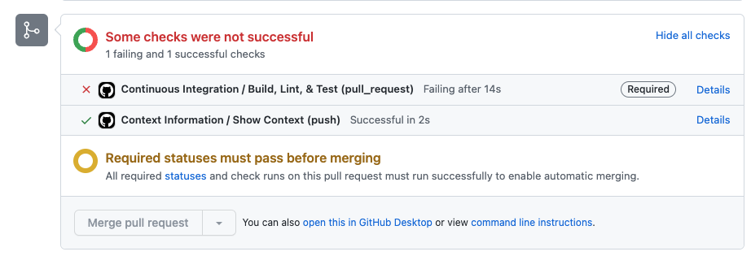

# Integrare Continuă

Un model comun pentru integrarea continuă implică utilizarea cererilor de extragere pentru a declanșa teste și alte sarcini de automatizare.

În exercițiul de mai jos, vom parcurge adăugarea de linting și testare pentru PR-urile unei aplicații Node.js. Acest lucru se va declanșa la crearea de PR-uri, precum și la actualizările codului din ramura la care se referă PR-ul.

## 1. Creează un workflow care se declanșează la crearea cererii de extragere

1. Treci la ramura **main** a repozitoriului tău
2. Creează un nou fișier numit `.github/workflows/ci-cd.yaml`
3. Copiază conținutul de mai jos în fișierul nou creat:

### Varianta Node.js:

```yaml
name: Continuous Integration & Delivery
on:
  pull_request:
  workflow_dispatch:
defaults:
  run:
    shell: bash
jobs:
  ci:
    name: Continuous Integration
    runs-on: ubuntu-latest
    defaults:
      run:
        working-directory: nodejs_app
    steps:
      - name: Clone
        uses: actions/checkout@v3.1.0
      - name: Setup Node
        uses: actions/setup-node@v3
        with:
          node-version: '18'
      - name: Install Dependencies
        run: npm ci
      - name: Run Linting
        run: npx eslint . --max-warnings 0
      - name: Run Tests
        run: npm test
```

4. Adaugă, commit și fa push modificărilor tale către ramura implicită.
5. Mergi la repozitorul tău și vizualizează pagina Actions pentru a vedea workflow-ul pe care l-ai creat (`Continuous Integration`)

Rezultatul va fi un workflow pe care îl poți executa manual și care este declanșat automat de un PR.

## 2. Activează protecția ramurii pe ramura ta **main**

Protecția ramurii este una dintre caracteristicile pe care GitHub le oferă și care îți permite să controlezi cine, ce și când poate fi împins pe o ramură. Pentru integrarea continuă, livrarea continuă și desfășurarea continuă, această caracteristică este esențială. În pasul de mai jos, vom activa aceasta pentru a ne asigura că niciun "cod rău" nu poate trece.

1. Activează protecția ramurii pentru ramura ta **main** ([instrucțiuni](https://docs.github.com/en/repositories/configuring-branches-and-merges-in-your-repository/defining-the-mergeability-of-pull-requests/managing-a-branch-protection-rule))
2. După ce ai adăugat modelul de nume al ramurii, folosește următoarele setări. Lasă totul necompletat, cu excepția:
   1. `Require a pull request before merging`
   2. `Require status checks to pass before merging`
   3. Caută și adaugă `Build, Lint, & Test` ca verificare de stare necesară (va apărea odată ce #2 este bifat)
   4. `Do not allow bypassing the above settings` (necesar pentru administratori)

## 3. Adaugă o nouă ramură și adaugă niște cod "rău"

Acum că ramura **main** este protejată, vom adăuga niște cod "rău" care va eșua la linting. Acest lucru ne va oferi un exemplu despre cum verificările de stare necesare ne vor împiedica să facem greșeli.

### Varianta Node.js:

1. Din ramura **main** a repozitoriului tău, creează o nouă ramură de cod numită `feature/bad`
2. Înlocuiește conținutul fișierului [nodejs_app/index.js](./nodejs_app/index.js) cu conținutul din [./nodejs_replacements/13-index.js](./nodejs_replacements/13-index.js)
3. Adaugă și comite modificările tale, apoi împinge ramura ta.
4. Mergi la depozitul tău, fă clic pe fila `Pull Requests` și deschide o cerere de extragere pentru a fuziona `feature/bad` în ramura ta **implicită**.

### Varianta Golang:

<details>
<summary>Click pentru a vedea exemplul Golang</summary>

1. Din ramura **implicită** a repozitoriului tău, creează o nouă ramură de cod numită `feature/bad`
2. Înlocuiește conținutul fișierului [golang_app/main.go](./golang_app/main.go) cu conținutul din [./golang_replacements/13-main.go](./golang_replacements/13-main.go)
3. Adaugă și comite modificările tale, apoi împinge ramura ta.
4. Mergi la depozitul tău, fă clic pe fila `Pull Requests` și deschide o cerere de extragere pentru a fuziona `feature/bad` în ramura ta **implicită**.

</details>

Rezultatul va fi incapacitatea de a fuziona (butonul va fi dezactivat) deoarece verificarea de stare pentru `Build, Lint, & Test` va eșua la pasul `Lint`. Aceasta este modalitatea prin care te asiguri că dezvoltatorii își asumă responsabilitatea și că există o calitate a codului.



Verificarile de stare care sunt necesare au insigna `Required` lângă ele. Pot fi adăugate verificări suplimentare pentru a include analiza statică a codului și altele.

## 4. Curățare
5. Închide cererea de extragere (nu fuziona)
6. Șterge ramura `feature/bad`