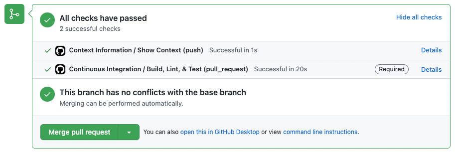
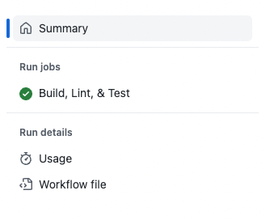
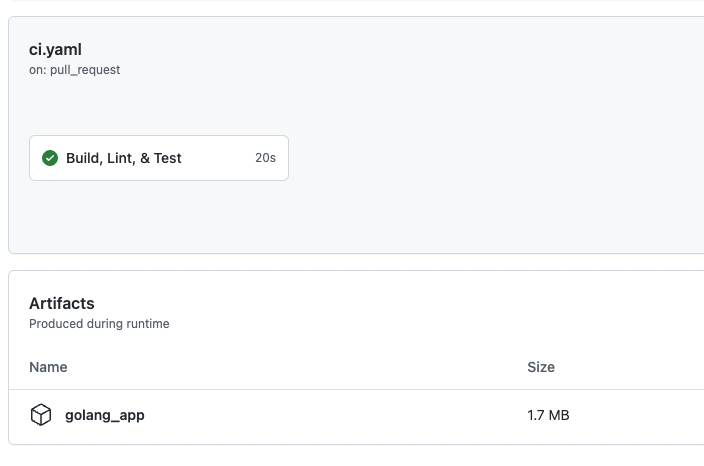

# Artefacte
GitHub oferă funcționalitatea de artefacte încorporată pentru salvarea și reutilizarea artefactelor între joburi. Aceste artefacte pot fi descrise pur și simplu ca un fel de output dintr-un proces de build. Acesta ar putea fi un binar, fișiere de suport sau practic orice vrei să transmiți de la un job la altul.

Exercițiul de mai jos te va ghida prin actualizarea workflow-ului `Continuous Integration` creat anterior (vezi [13-Continuous-Integration](./13-Continuous-Integration.md)) cu acțiunea de artefacte care va gestiona salvarea artefactului creat din procesul nostru de build. Ulterior, vom folosi acest lucru pentru a livra continuu o imagine Docker cu artefactul nostru (vezi [16-Packages](./16-Packages.md)).

> **Notă**: Există și un exemplu Golang disponibil în directorul `golang_app` dacă preferi să lucrezi cu Go.

## 1. Adaugă acțiunea de salvare a artefactului
Prin adăugarea acțiunii publice `actions/upload-artifact` la workflow-ul nostru `Continuous Integration`, avem o modalitate ușor de utilizat pentru a lucra cu API-ul Artefactelor.

1. Din ramura **implicită** a repozitoriului tău, creează o nouă ramură de cod numită `feature/artifacts`
2. Deschide fișierul numit `.github/workflows/ci-cd.yaml`
3. Înlocuiește conținutul fișierului cu:

### Varianta Node.js:

```yaml
name: Continuous Integration & Delivery
on:
  pull_request:
  workflow_dispatch:
defaults:
  run:
    shell: bash
jobs:
  ci:
    name: Continuous Integration
    runs-on: ubuntu-latest
    defaults:
      run:
        working-directory: nodejs_app
    steps:
      - name: Clone
        uses: actions/checkout@v3.1.0
      - name: Setup Node
        uses: actions/setup-node@v3
        with:
          node-version: '18'
      - name: Install Dependencies
        run: npm ci
      - name: Run Linting
        run: npx eslint . --max-warnings 0
      - name: Run Tests
        run: npm test
      - name: Store Artifact
        uses: actions/upload-artifact@v3.1.0
        with:
          name: nodejs_app
          path: nodejs_app/
```

### Varianta Golang:

<details>
<summary>Click pentru a vedea exemplul Golang</summary>

```yaml
name: Continuous Integration & Delivery
on:
  pull_request:
  workflow_dispatch:
defaults:
  run:
    shell: bash
jobs:
  ci:
    name: Continuous Integration
    runs-on: ubuntu-latest
    defaults:
      run:
        working-directory: golang_app
    steps:
      - name: Clone
        uses: actions/checkout@v3.1.0
      - name: Get Dependencies
        run: go get app
      - name: Build
        run: go build
      - name: Run Linting
        uses: golangci/golangci-lint-action@v3
        with:
          working-directory: golang_app
      - name: Run Tests
        run: go test
      - name: Store Artifact
        uses: actions/upload-artifact@v3.1.0
        with:
          name: golang_app
          path: golang_app/app
```

</details>

4. Adaugă și comite modificările tale, apoi împinge ramura ta.
5. Mergi la depozitul tău și vizualizează fila `Pull Requests`.
6. Deschide o cerere de extragere pentru a fuziona `feature/artifacts` în ramura ta **implicită**.
7. Fă clic pe linkul `Show All Checks` de pe verificările de stare din cererea ta de extragere, apoi fă clic pe linkul `Details` de lângă `Continuous Integration`.



8. Fă clic pe linkul `Summary` din navigarea din stânga.



Rezultatul va fi un artefact pe care utilizatorii autentificați îl pot descărca. În plus, acest artefact poate fi utilizat în desfășurare sau în alte automatizări folosind acțiunea `actions/artifact-download`.

Este important de menționat că retenția artefactelor este valabilă doar atât timp cât este [configurată](https://docs.github.com/en/organizations/managing-organization-settings/configuring-the-retention-period-for-github-actions-artifacts-and-logs-in-your-organization) pentru organizația sau întreprinderea ta.



## 2. Fuzionează modificările în ramura ta **implicită** și actualizează-ți repozitoriul local

1. Fă clic pe butonul verde `Merge pull request` din cererea de extragere de la pasul 1.6. Acest lucru va pune codul tău în ramura principală.
2. Șterge ramura publicată creată în [Pasul 1](#step-1-add-the-artifact-save-action)
3. Treci la ramura **implicită** a repozitoriului tău local și execută `git pull` pentru a-ți actualiza depozitul local.