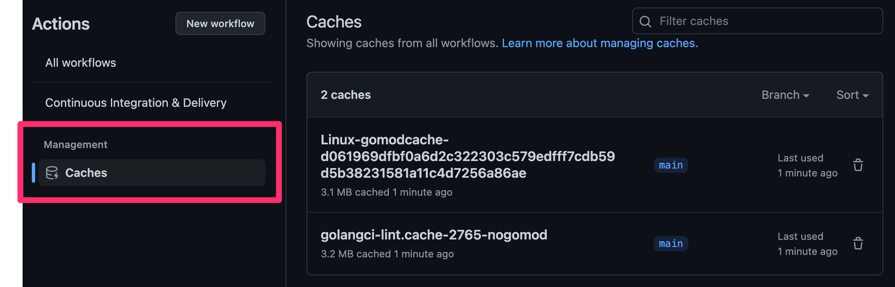

# Caching

Cand lucrezi cu workflow-uri, s-ar putea sa te regasesti efectuand acelasi set de sarcini de mai multe ori in cadrul fluxurilor de lucru sau chiar al joburilor. Acest lucru este frecvent intalnit in scenarii de construire unde se descarca dependente. Deoarece runner-ele Actions sunt efemere, fisierele dintr-o executie anterioara sunt sterse.

Acest lucru poate cauza inevitabil ca construirile sa dureze mai mult, mai ales atunci cand numarul de dependente utilizate este numeros.

In exercitiul anterior despre `Continuous Integration`, ai construit un workflow care efectueaza automatizari atunci cand cererile de extragere sunt deschise pentru a face merge in ramura **main**. In acest exercitiu, vom reutiliza acel flux de lucru pentru a demonstra putin cachingul.

## 1. Adaugă acțiunea de cache
1. Din ramura **main** a repozitoriului tău, creează o nouă ramură de cod numită `feature/cache`
2. Deschide fișierul numit `.github/workflows/ci-cd.yaml`
3. Înlocuiește conținutul fișierului cu:

### Node.js:

```yaml
name: Continuous Integration & Delivery
on:
  pull_request:
  workflow_dispatch:
defaults:
  run:
    shell: bash
jobs:
  ci:
    name: Continuous Integration
    runs-on: ubuntu-latest
    defaults:
      run:
        working-directory: nodejs_app
    steps:
      - name: Clone
        uses: actions/checkout@v3.1.0
      - name: Setup Node
        uses: actions/setup-node@v3
        with:
          node-version: '18'
          cache: 'npm'
          cache-dependency-path: nodejs_app/package-lock.json
      - name: Install Dependencies
        run: npm ci
      - name: Run Linting
        run: npx eslint . --max-warnings 0
      - name: Run Tests
        run: npm test
      - name: Store Artifact
        uses: actions/upload-artifact@v3.1.0
        with:
          name: nodejs_app
          path: nodejs_app/
```

4. Înlocuiește conținutul fișierului [nodejs_app/index.js](./nodejs_app/index.js) cu continutul din [./nodejs_replacements/15-index.js](./nodejs_replacements/15-index.js)
5. Înlocuiește conținutul fișierului [nodejs_app/package.json](./nodejs_app/package.json) cu continutul din [./nodejs_replacements/15-package.json](./nodejs_replacements/15-package.json)
6. Înlocuiește conținutul fișierului [nodejs_app/package-lock.json](./nodejs_app/package-lock.json) cu continutul din [./nodejs_replacements/15-package-lock.json](./nodejs_replacements/15-package-lock.json)
7. Adaugă și comite modificările tale, apoi fa push ramurii tale.
8. Mergi la repozitorul tău și vizualizează pagina `Pull Requests`.
9. Deschide un PR pentru a face merge `feature/cache` în ramura ta **main**.

## 2. Vizualizează zona "Caches" pe Workflow
În cadrul vizualizării workflow-ului, cache-urile pentru orice workflow dat pot fi văzute. Va trebui să ai mai întâi o execuție de succes, dar ulterior vizualizarea va fi disponibilă.

1. Mergi la fila `Actions` din depozitul tău.
2. Fă clic pe workflow-ul `Continuous Integration & Delivery` din stânga.
3. În cele din urmă, fă clic pe linkul `Caches` din navigarea din stânga. Poți face acest lucru și din partea de sus (nu este nevoie să te duci în `Actions`) pentru a vedea toate cache-urile dintr-un depozit.




## 3. Fuzionează modificările în ramura ta **implicită** și actualizează-ți repozitoriul local

1. Fă clic pe butonul verde `Merge pull request` din cererea de extragere din pasul 1.9. Acest lucru va pune codul tău în ramura principală.
2. Șterge ramura publicată creată în [Pasul 1](#step-1-add-the-cache-action).
3. Checkout pe ramura ta implicită local și trage modificările.

---

## Documetație suplimentară
- [GitHub Actions Caching](https://github.com/actions/cache)